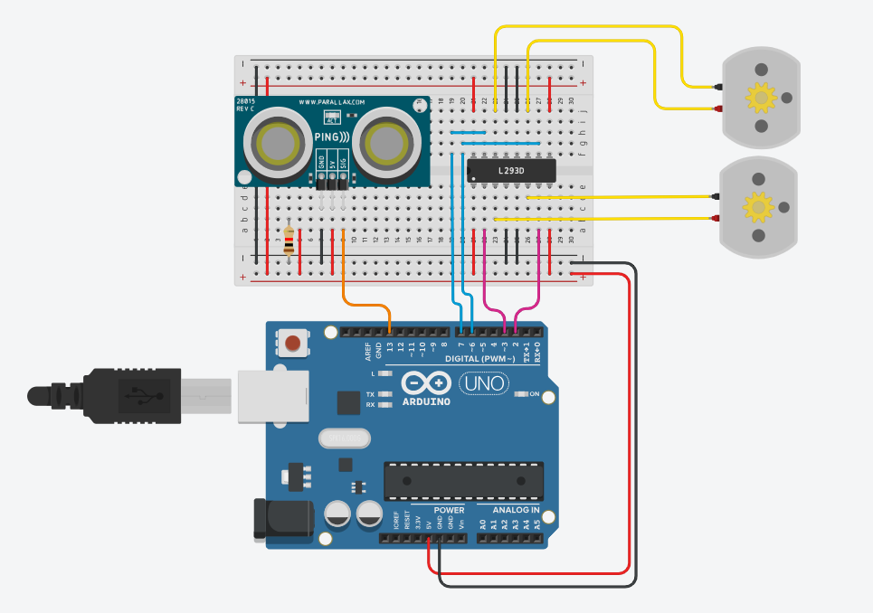

# Robo Desviador

Este projeto apresenta um robô capaz de evitar obstáculos usando sensores e um algoritmo de evasão. O esquema elétrico exibido acima foi feito no thinkercad e apresentado em sala de aula.
Link: https://www.tinkercad.com/things/9M25Ux57Fd2-robo-desviador

## Imagem Demonstrativa do Robo

## Demonstração de Como Seria o Funcionamento do Robo

## Créditos

O vídeo e a imagem foi encontrada no canal: (Eduardo Fritzen - ConectaBit)

