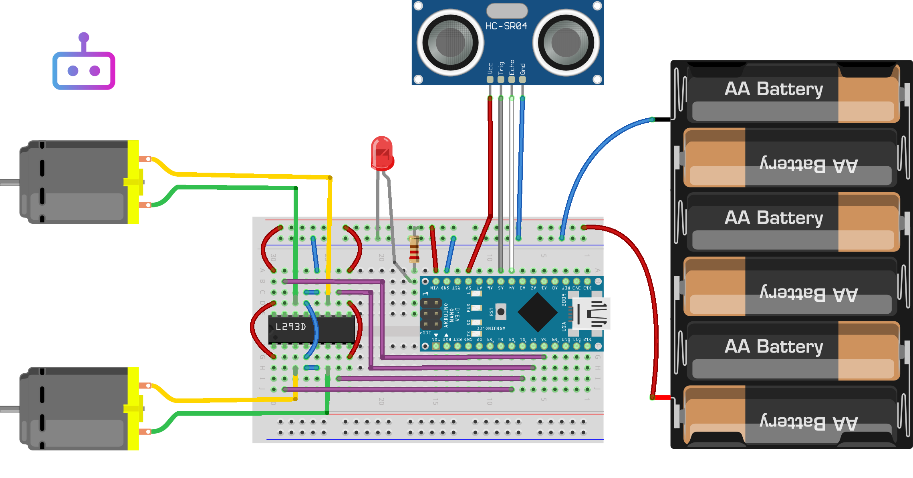

# Robot Desviador

Este projeto apresenta um robô capaz de evitar obstáculos usando sensores e um algoritmo de evasão. O esquema elétrico exibido acima foi gerado utilizando o software Fritzing.

## Vídeo Demonstrativo
Confira o vídeo demonstrativo no YouTube para ver o robô em ação:

## Autores

- Eduardo Fritzen - ConectaBit
